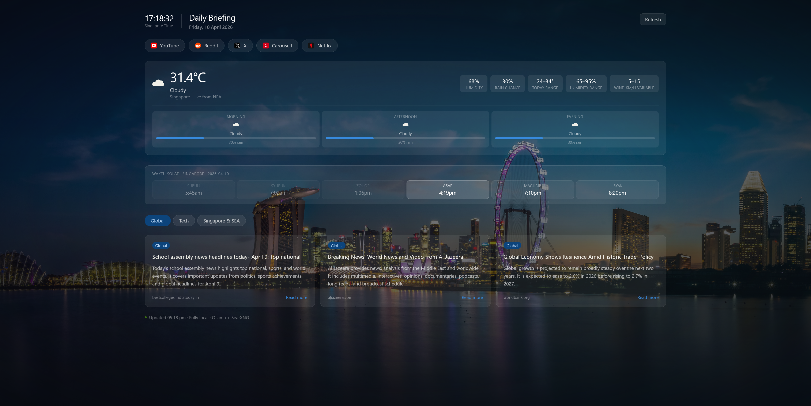

# Daily Briefing — Local AI Dashboard

A fully self-hosted morning dashboard powered by a local LLM running on consumer hardware. No cloud APIs, no subscriptions, no data leaving your machine.



## What it does

Opens in your browser every morning and automatically shows:

- **Live weather** — current temperature, humidity, rain chance, and a 4-period day forecast pulled from Singapore's National Environment Agency (NEA) API
- **Waktu Solat** — today's prayer times from the official MUIS dataset via aladhan.com, with the current prayer period highlighted and auto-updating every minute
- **AI-summarised news** — 3 tabs (Global, Tech, Singapore & SEA), each showing 3 distinct stories summarised from live web search results by a local LLM
- **Live clock** — Singapore Time ticking in real time

## Stack

| Component | Purpose |
|-----------|---------|
| NVIDIA RTX 5090 (32GB VRAM) | Runs the LLM locally at ~60 tokens/sec |
| Ollama | LLM inference backend |
| Qwen3 32B (Q4_K_M) | The language model — 32 billion parameters, quantised to fit in GPU VRAM |
| SearXNG | Private self-hosted search engine, no tracking |
| Open WebUI | Chat interface connected to Ollama |
| nginx (Docker) | Local web server + reverse proxy |
| NEA API | Live Singapore weather data |
| aladhan.com API | Singapore prayer times (MUIS method) |
| Tailscale | Secure remote access from phone and other devices |

## Architecture

```
Browser (localhost:5500)
    │
    ▼
nginx (Docker)
    ├── /searxng/  →  SearXNG (port 8080)  →  Web search results
    ├── /ollama/   →  Ollama (port 11434)  →  Qwen3 32B on RTX 5090
    └── /          →  morning-news.html (served as static file)

External APIs (called directly from browser):
    ├── api-open.data.gov.sg  →  NEA weather
    └── api.aladhan.com       →  Prayer times
```

## How the news works

1. For each tab, the app runs 5 search queries through SearXNG (e.g. "top world news today", "breaking news today")
2. Results are filtered — social media domains (Facebook, Reddit, Twitter etc.) and thin snippets are discarded
3. All results are pooled and sent to Qwen3 32B in a single prompt
4. The model is instructed to pick 3 stories on **different topics** and summarise each using **only** the snippet text provided — no hallucination from training data
5. Cards render with headline, summary, source, and link

## Key technical decisions

- **Single Ollama call per tab** instead of one per story — reduces hallucination overlap and cuts load time by 3×
- **`think: false`** in all API calls — disables Qwen3's chain-of-thought mode for faster JSON output
- **`time_range=day`** on all SearXNG queries — ensures only today's news is returned
- **nginx as reverse proxy** — solves browser CORS restrictions without modifying any service configs
- **`host.docker.internal`** in nginx config — makes the setup reboot-stable regardless of IP changes

## Hardware

- CPU: AMD Ryzen 9800X3D
- GPU: NVIDIA RTX 5090 (32GB GDDR7)
- RAM: 32GB DDR5
- OS: Windows 11

## Setup

See the full setup guide in [SETUP.md](SETUP.md).

## What I learned

- Running large language models locally on consumer hardware
- Prompt engineering for structured JSON output and hallucination prevention
- Docker networking, reverse proxies, and CORS
- Integrating multiple APIs (NEA, MUIS, Ollama, SearXNG) into a single frontend
- Tailscale for secure remote access across devices
- Building a production-quality local AI stack from scratch
